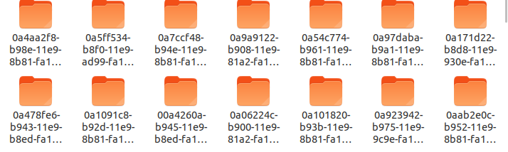
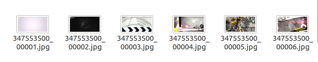
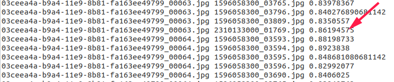

# 2019年ccf-bdci [视频版权检测算法](https://www.datafountain.cn/competitions/354) Top10方案

稳住,我们能赢队,复赛B榜线上最终排名为第十名,分数是0.38148147

## 数据集
[官方下载](https://www.datafountain.cn/competitions/354/datasets)  
## baseline
baseline是[阿水的开源仓库](https://github.com/finlay-liu/kaggle_public/tree/master/CCF2019-%E8%A7%86%E9%A2%91%E7%89%88%E6%9D%83%E6%A3%80%E6%B5%8B%E7%AE%97%E6%B3%95)

## 整体思路:
1. 用ffmpeg工具包视频进行进行抽帧
2. 提取图片的特征
3. 对query,refer特征进行归一化,query,refer图片特征求余弦,对比其特征相似度,筛选出特征相似度较高的匹配图片.
4. 观察匹配图片,并进行数据清理,对齐时间,提交结果

## 我们的方案以及处理细节:  
- 抽帧:对视频每秒抽1帧  
抽帧如图:  

  
- 特征工程:
    - 选取模型去掉最后softmax的特征矩阵
    - 尝试了一系列resnet,densnet及其衍生类模型,最终确定se-resnet50的特征效果相较其他模型好一些
-   相似图片匹配:用[faiss库](https://github.com/facebookresearch/faiss)进行加速匹配(此场景中时间加速了近10倍)
- 数据清理以及时间对齐:
 -  选取源自一个视频的图片相匹配的图片中源自一个视频出现次数最多的图片,其余图片组合过滤
 如图  
 红标数据进行过滤
 -在时间段内进行划窗,划窗参数自己选择

 ## 未能实现
   待更新

## 运行环境:
- ubuntu18.04
- python3.5
- torch1.2.0
- faiss 1.6.0
- ...运行过程中缺啥pip or conda吧,无特殊版本要求

## 代码框架:
- input/
 - query 存放query数据
 - refer  存放refer数据
 - query_frame 存放query每秒帧数据
 - refer_frame 存放refer每秒帧数据
-pic md图片
-script/  一些脚本
 - compute_result.py 本地计算train中的分数
 - compute_time_diff.py 计算时间相差,得到csv,对模型进行评分
 - sort_and_mix.py 模型结果融合
-extract_keyframe.py(extract_keyframe.ipynb) 对视频每秒的帧进行提取
-main.py(main.ipynb) 得到图片相似度匹配的结果
-tran.csv 官方给的label
-train_get_acc.py   评估训练后模型的性能
-time_serialize_data.py 数据清洗和时间对齐
- train.py(train.ipynb) 模型训练

## Run:
1. `python extract_keyframe.py`  
对视频提取每秒的帧
2. `python main.py`  
得到图片相似度匹配的结果
3. `python time_serialize_data.py`  
数据清洗,时间对齐,并且得到要提交的结果

## Contact:
如代码有问题或交流,请联系:yongfucheng@qq.com

## 特别声明和感谢
此代码和方案是与队友共同思考讨论的结果,

队员情况说明:5个太原理工大学大三年级的学生
